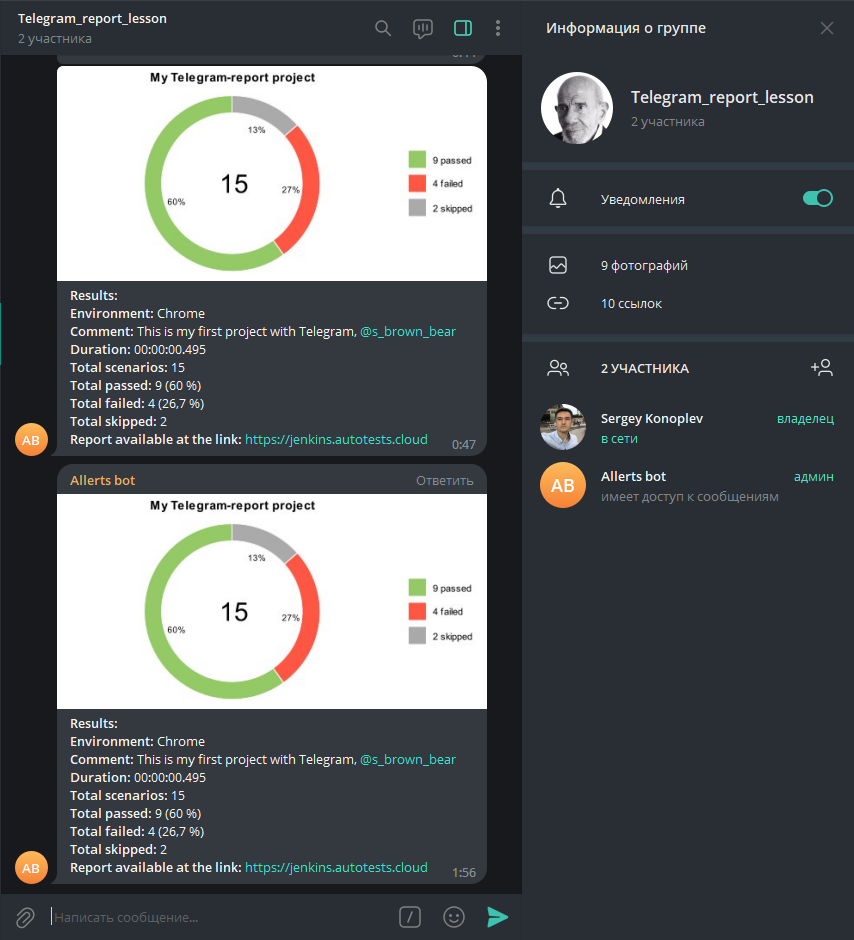

# Телеграм бот с результатом выполненных тестов

## Инструкция. Материал взят с [репозитория](https://github.com/qa-guru/knowledge-base/wiki/12.-%D0%9E%D1%82%D0%BF%D1%80%D0%B0%D0%B2%D0%BB%D1%8F%D0%B5%D0%BC-%D1%83%D0%B2%D0%B5%D0%B4%D0%BE%D0%BC%D0%BB%D0%B5%D0%BD%D0%B8%D1%8F-%D0%BE-%D1%80%D0%B5%D0%B7%D1%83%D0%BB%D1%8C%D1%82%D0%B0%D1%82%D0%B0%D1%85-%D0%BF%D1%80%D0%BE%D1%85%D0%BE%D0%B6%D0%B4%D0%B5%D0%BD%D0%B8%D1%8F-%D0%B0%D0%B2%D1%82%D0%BE%D1%82%D0%B5%D1%81%D1%82%D0%BE%D0%B2) qa.guru

- Зайти в Jenkins. [Ссылка](https://jenkins.autotests.cloud/job/student-qa_guru_sergey_konoplev_notifications/) на сборку

- Перейти: сборочная директория/allure-report/widgets/иконка глаза summary.json

		{
			reportName: "Allure Report",
			testRuns: [ ],
			statistic: {
				failed: 4,
				broken: 0,
				skipped: 2,
				passed: 9,
				unknown: 0,
				total: 15
		},
		time: {
			start: 1695228002443,
			stop: 1695228002700,
			duration: 257,
			minDuration: 0,
			maxDuration: 89,
			sumDuration: 105
			}
		}

- Перейти [gist.github.com/dideler/bot.rb](https://gist.github.com/dideler/85de4d64f66c1966788c1b2304b9caf1) и ознакомиться с документом `readme.md`

- В корне проекта создать папку `notifications`, в папке создать файл `draft.txt` - для хранения команд и пр.

- Найти в телеграме `botFather`, запустить, newbot, Allerts bot, qa_ks58_bot.

- Скопировать название и токен в файл `draft.txt`

- Создать группу в телеграме, добавить бота в группу, дать админку.

- Добавляем токен нашего бота в ссылку `https://api.telegram.org/bot$6476280630:AAFYvVpvAQHT-NkwE5Gm8wdKB-_msxbSuM0/getUpdates` и вставляем в браузер.
Пишем в чат бот любое сообщение, и обнавяем ссылку. Копируем chat id в папку `draft.txt` `-1001966724199`

- В `curl -X POST` вставляем полученный telegram token и chat id
На сайте github.com/qa-guru/allure-notifications/releases скачать файл-библиотеку `allure-notifications-4.3.0.jar`, добавили в папку `notification` и добавили на удаленный репозиторий.

- Создали файл `config.json` в папке `notifications` и добавили:

		{
		"base": {
			"logo": "",
			"project": "",
			"environment": "",
			"comment": "",
			"reportLink": "",
			"language": "ru",
			"allureFolder": "",
			"enableChart": false
			},
		"telegram": {
			"token": "",
			"chat": "",
			"replyTo": ""
			}
		}

- Запустить тест командой в терминале:
`java "-DconfigFile=notifications/config.json" -jar notifications/allure-notifications-4.2.1.jar`
